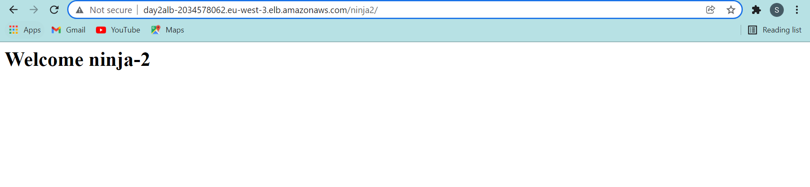

# Assigment2

Aws Assigment 2 
## Authors

- Simranjeet Singh
## Documentation

## Setup LAMP stack in aws cloud & there should be 1 ec2 in each private subnet.
## port 22 of  both the lamp servers should only be accessible from bastion host.
## port 80 open of lamp stacks should only be accessible from your ALB.
## port 80 open of ALB should only be accessible from your public IP.
## ALB should only be accessible though your public IP none else.

## 1 bastion host in public subnet.
## port 22 of bastion host should only accessible from your public ip.

## lamp 1 welcome page with path '/ninja1' on first ec2 should display        
## Welcome ninja-1.
## create listener rule so that {YOUR-ALB-DNS-NAME}/ninja1 should display welcome page of first ec2.

## lamp 2 welcome page with path '/ninja2' on second ec2 should display        ## Welcome ninja-2.
## create listener rule so that {YOUR-ALB-DNS-NAME}/ninja2 should display welcome page of second ec2.

## Create target group for each lamp stack.
## Create Application load balancer.

