# Assigment2

### Aws Assigment 6
## Authors

### - Simranjeet Singh
## TO DO

### IAM roles and policies.

##### Create 3 Group's

##### 1. Devloper

###### set of permissions:

##### ec2

###### start
###### stop
###### change instance type
###### read

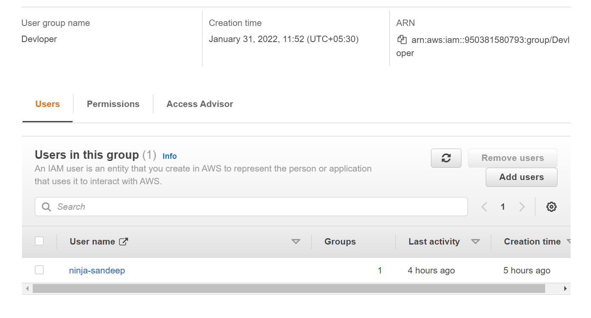
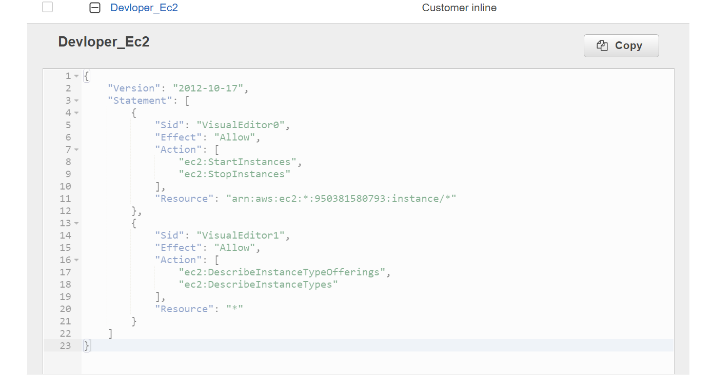
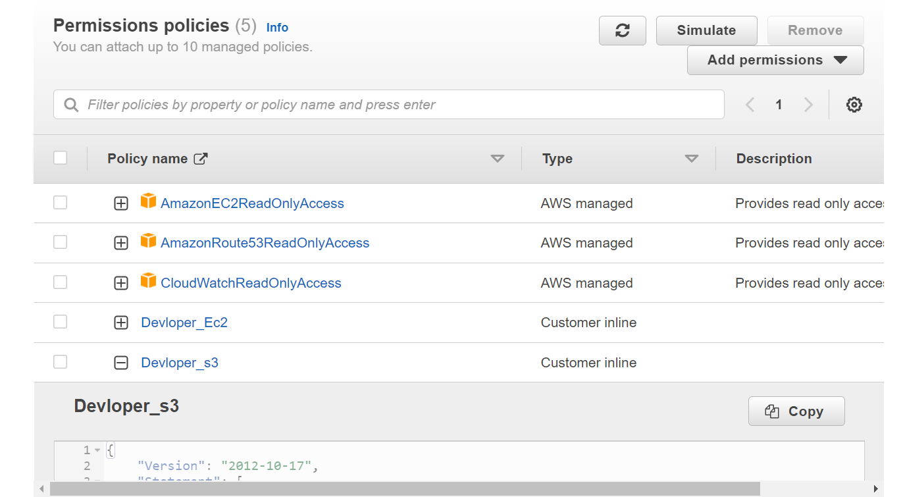

##### S3

###### create
###### list
###### get
###### put

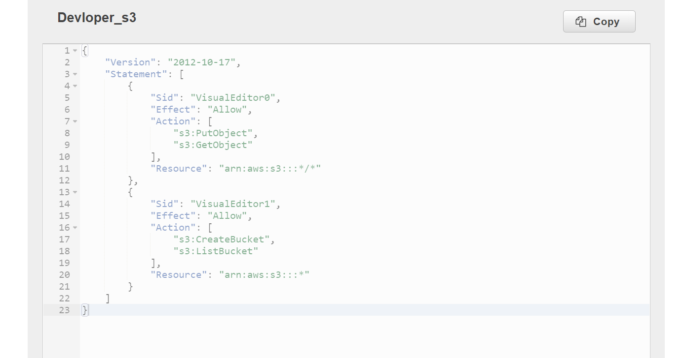

##### CloudWatch

###### read only

##### Route53

###### read only

##### 2. DevOps

###### set of permissions:

###### DevOps should be able to manage all resources along with permission management.

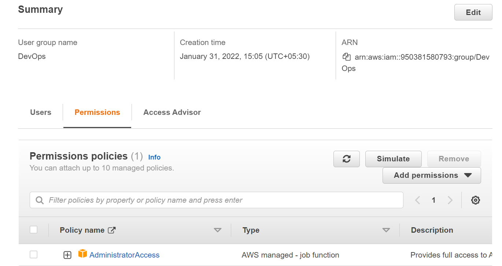

##### 3. QA:

###### set of permissions:

##### S3

###### list
###### get

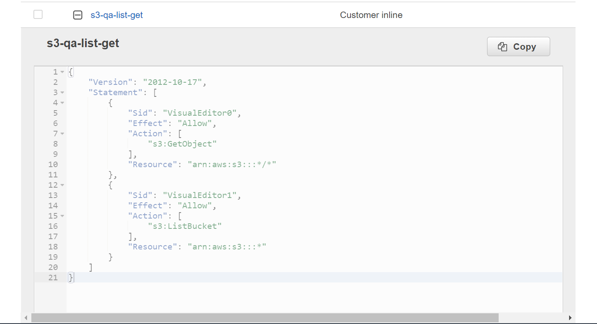

##### EC2

###### read only

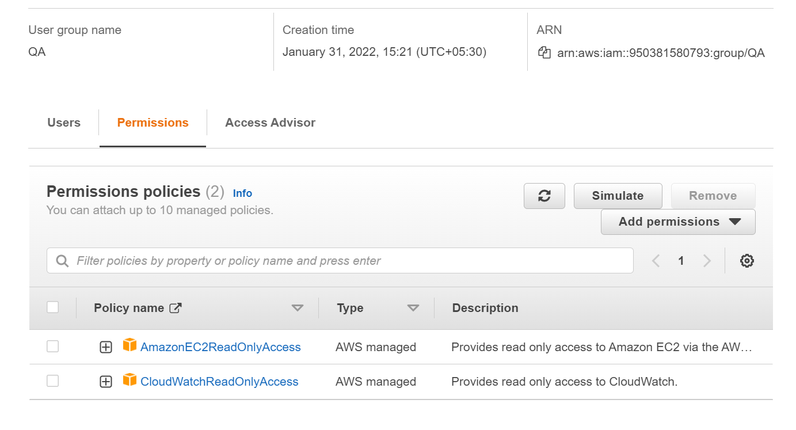

##### Cloudwatch

###### read only

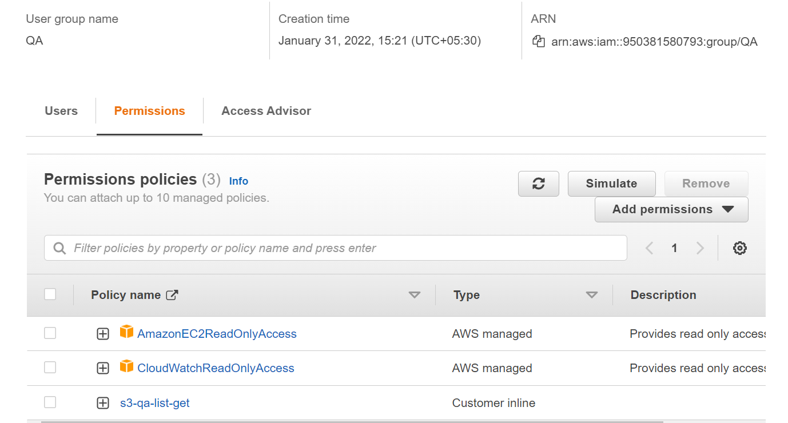

##### create 3 user for your ninja buddy ,cross-buddy,code-reviewer and assign them one Group to each and verify permissions

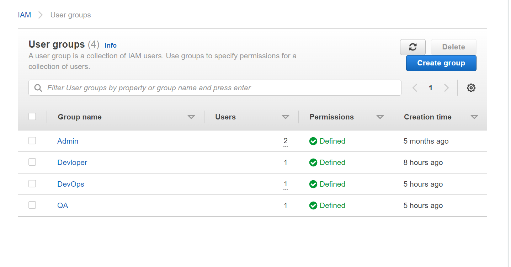

##### Create a role for EC2 which will have permissions for

###### S3

###### list
###### get
###### put
###### create

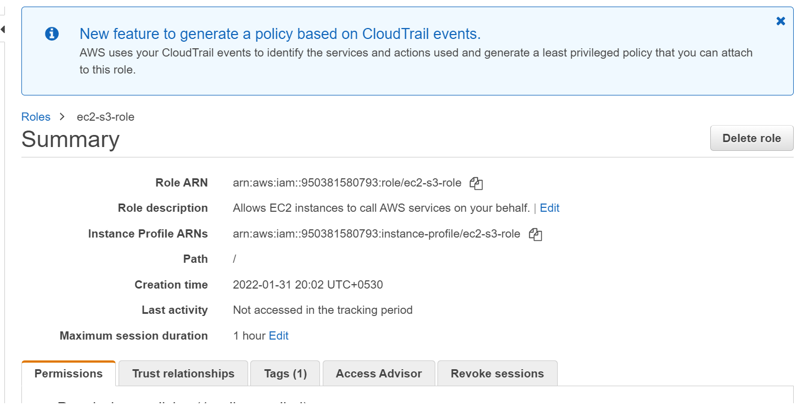
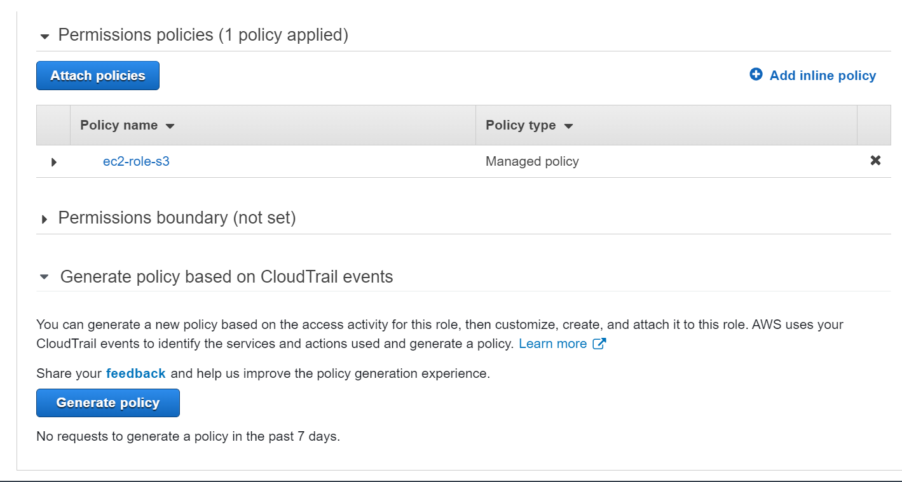

###### Now create a EC2 and attach the created role to it
###### Using aws-cli create a s3 bucket  using EC2 machine and try listing s3 bucket

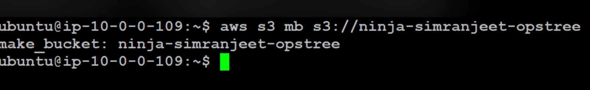