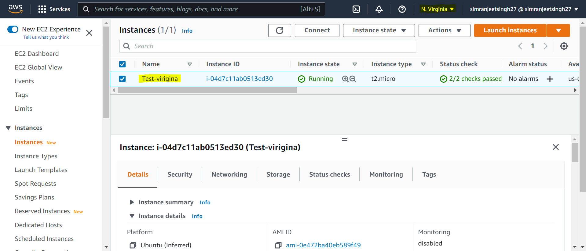
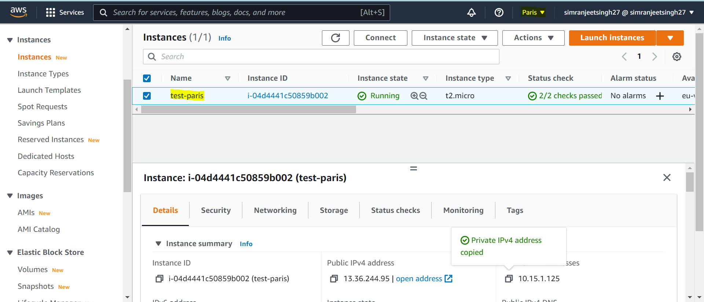
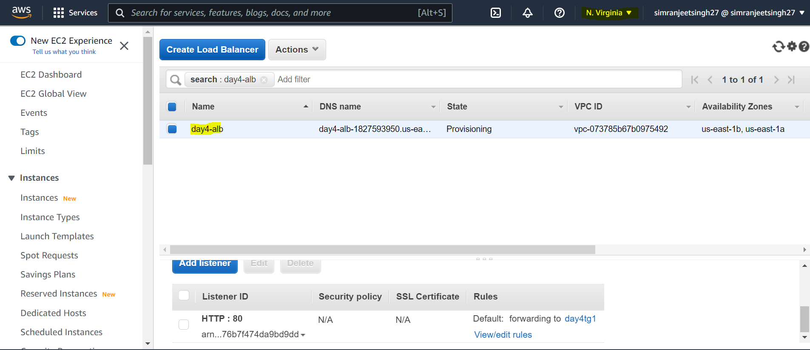
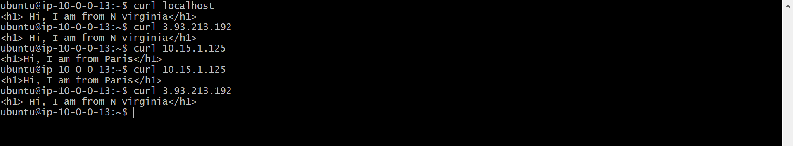
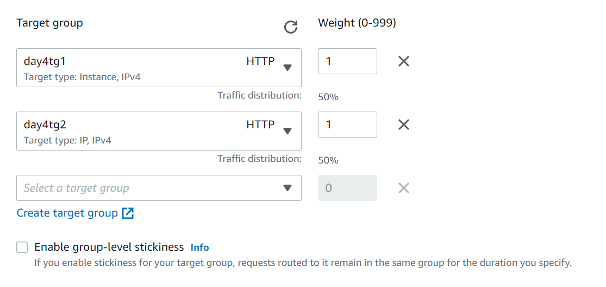
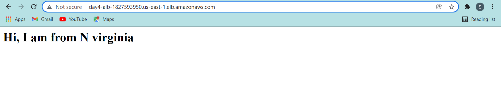
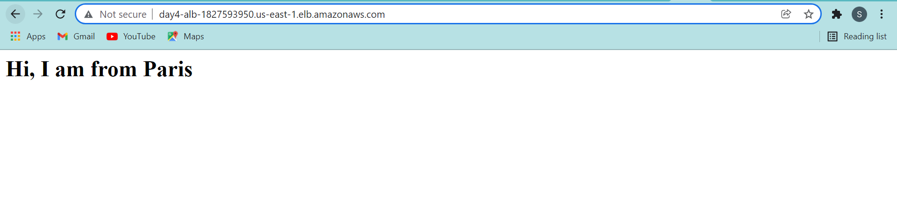

# Assigment2

### Aws Assigment 4
## Authors

### - Simranjeet Singh
## TO DO

### Create 1 instance in Paris and 1 in North Virginia

### Create load balancer in North Virginia.

### Setup Application in your EC2 instance (nginx with welcome page {welcome to Region_Name })

### Try to load balance between these 2 Instances

### Bring a solution to power off instance after 6PM and bring it up at 6AM.

