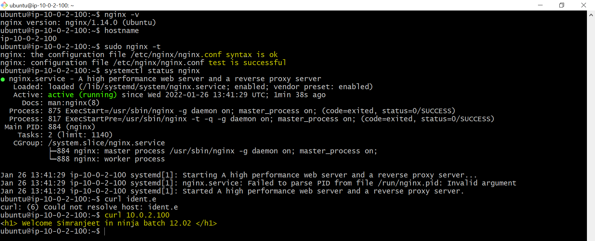

# Assigment2

### Aws Assigment 3
## Authors

### - Simranjeet Singh
## TO DO

### Create EC2 in private subnet.

### Setup Application in your EC2 instance (nginx with welcome page {welcome your_name in ninja batch   X}) .

### Create AMI of that EC2 Instance.

### Create Launch Template with (version)v1.

### Create Autoscaling group(thresold value should be 60% of compute resources).

### Create lb and attach it to ASG.

### Hit your Loadbalancer's dns arn and see if the ec2 instance page is coming or not.

### From Auto sacling new instance has been launched.

### Now update the previous Launch Template using userdata script changing its welcome page {welcome your_buddy_name in ninja batch   X}.

### Now increase your load using stress on ec2.

### Now check if the number of ec2's has increased according to your policy.

